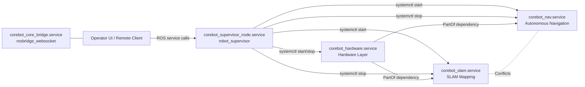

# CoreBot Service Orchestrator

Industrial-grade Linux service orchestration for ROS 2 robot operations.

This project provides a robust, **systemd-managed runtime control** environment and a **ROS 2 supervisor node** that exposes a stable service API for higher-level applications. It transforms a standard ROS 2 workspace into a production-ready deployment that can be easily installed on any robot hardware.

## Mission

Provide production-style process control for robot operations:

- **Deterministic Startup/Shutdown:** Robust management through `systemd`.
- **Dynamic Deployment:** Automatically configures itself for the active user, workspace path, and hardware group (`robot`) during installation, enabling seamless deployment across different robots (e.g., Raspberry Pi, Jetson).
- **Runtime Mode Switching:** Switch between `slam`, `nav`, and `idle` states dynamically through ROS 2 services.
- **Safety Lockouts:** Prevents autonomy stacks from starting when hardware/sensors are offline.
- **Crash Recovery:** Automatic restart and failure recovery profiles using `Restart=` behaviors.
- **Mutual Exclusion:** Strict `Conflicts=` policies prevent incompatible stacks (like SLAM and Navigation) from running simultaneously.

## Architecture



## Key Components

- `corebot_supervisor_node.service`
  - Runs the ROS 2 Supervisor Node (`ros2 run corebot_manager supervisor_node`).
  - Exposes ROS 2 service endpoints for `/corebot/robot_turn_on_off` and `/corebot/set_mode`.
  - Internally dispatches `sudo systemctl <start|stop> <service>` to manage system state securely.

- `corebot_hardware.service`
  - Starts the core hardware or simulation layer.
  - Acts as the foundational layer; autonomy stacks cannot run without this active.

- `corebot_slam.service`
  - Starts the SLAM stack for mapping.
  - Protected by `ExecStartPre` safety checks to ensure hardware is active.
  - Gracefully saves maps upon termination using `SIGINT` and `KillMode=mixed`.

- `corebot_nav.service`
  - Starts the Autonomous Navigation stack (`Nav2`).
  - Strict mutual exclusion with SLAM (`Conflicts=corebot_slam.service`).

- `corebot_core_bridge.service`
  - Starts `rosbridge_websocket` for external clients, fleet management systems, and UI integration.

## ROS 2 Supervisor API

**Service Type:** `corebot_interfaces/srv/SetMode`
- **Request:** `string mode`
- **Response:** `bool success`, `string message`

**Endpoints & Commands:**

- `/corebot/robot_turn_on_off`
  - `mode: "on"` → Starts `corebot_hardware.service`
  - `mode: "off"` → Stops `corebot_hardware.service` (automatically tears down dependent autonomy stacks).

- `/corebot/set_mode`
  - `mode: "slam"` → Starts `corebot_slam.service`
  - `mode: "nav"` → Starts `corebot_nav.service`
  - `mode: "idle"` → Stops active SLAM/NAV services cleanly.

## Installation & Deployment

The system is designed to be easily deployable on any robot. The `install.sh` script dynamically detects the executing user and workspace path, eliminating hardcoded variables.

**1. Build the Workspace:**
```bash
colcon build
source install/setup.bash
```

**2. Install Services:**
```bash
sudo ./install.sh
```

**What the installer does automatically:**
- Detects the current user (via `$SUDO_USER` or `whoami`).
- Creates a `robot` hardware access group and adds the user to it.
- Injects dynamic paths and user credentials into the systemd `.service` templates.
- Installs the parameterized `.service` files into `/etc/systemd/system/`.
- Enables and starts the core bridge and supervisor services on boot.

## Sudoers Configuration (`visudo`)

The `corebot_supervisor_node` internally executes commands like `sudo systemctl start corebot_slam.service` to manage the different stacks. To prevent this node from getting stuck at a password prompt, you must grant passwordless sudo access for these specific commands.

**Run the visudo command:**
```bash
sudo visudo
```

**Add the following line to the bottom of the file (replace `YOUR_USERNAME` with your actual username, e.g., `ahmed`):**
```text
YOUR_USERNAME ALL=(ALL) NOPASSWD: /bin/systemctl start corebot_*.service, /bin/systemctl stop corebot_*.service, /bin/systemctl restart corebot_*.service
```

Alternatively, if you want to grant this to anyone in the `robot` group, add:
```text
%robot ALL=(ALL) NOPASSWD: /bin/systemctl start corebot_*.service, /bin/systemctl stop corebot_*.service, /bin/systemctl restart corebot_*.service
```

## Operations Runbook

**Check the status of all stacks:**
```bash
systemctl status corebot_supervisor_node.service
systemctl status corebot_hardware.service
systemctl status corebot_slam.service
systemctl status corebot_nav.service
systemctl status corebot_core_bridge.service
```

**View live logs (replace service name as needed):**
```bash
journalctl -u corebot_supervisor_node.service -f
```

**Manual mode control through ROS 2 CLI:**
```bash
# Turn on hardware
ros2 service call /corebot/robot_turn_on_off corebot_interfaces/srv/SetMode "{mode: 'on'}"

# Start Mapping
ros2 service call /corebot/set_mode corebot_interfaces/srv/SetMode "{mode: 'slam'}"

# Switch to Navigation
ros2 service call /corebot/set_mode corebot_interfaces/srv/SetMode "{mode: 'nav'}"

# Stop Autonomy
ros2 service call /corebot/set_mode corebot_interfaces/srv/SetMode "{mode: 'idle'}"

# Shutdown Robot Hardware
ros2 service call /corebot/robot_turn_on_off corebot_interfaces/srv/SetMode "{mode: 'off'}"
```

## Repository Layout

- `services/` - `systemd` unit template files (`REPLACE_ME_USER` and `REPLACE_ME_WORKSPACE`).
- `src/corebot_manager/` - C++ ROS 2 Supervisor Node.
- `src/corebot_interfaces/` - ROS 2 custom service definitions.
- `install.sh` - Dynamic service installation and bootstrap script.
